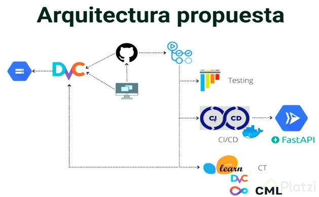
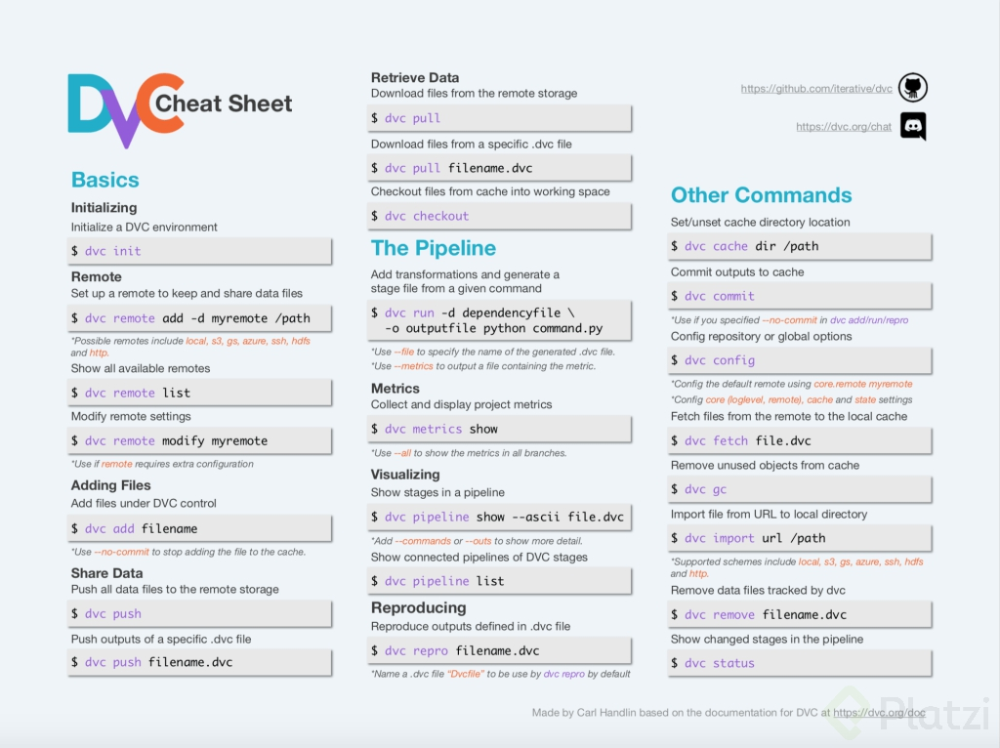

# Notes by Esteban Encina
## [First read](https://ml-ops.org/content/end-to-end-ml-workflow)

## [Second read](https://ml-ops.org/content/three-levels-of-ml-software)

## Project Architecture


# Enviroment
## Create a conda environment
```
conda create -n mlops python=3.9
```
## Activate the conda environment
```
conda activate mlops
```
## Install dependencies
```
pip install -r requirements.txt
```
## Install Ipykernel
```
conda install -n mlops_platzi ipykernel --update-deps --force-reinstall
```
# DVC
## Basic commands
### Init a new project
```
dvc init
```
### Add a new file
```
dvc add README.md
```
## More commands


## Install DVC
```
pip install dvc
```
## Init dvc
```
dvc init
```
## I'm going to use DVC with Google Drive to manage my project, add remote with Google Drive
Install dvc_gdrive with pip
```
pip install dvc-gdrive
```
Then add the remote as:
```
dvc remote add myremote gdrive://1U0nayKU5gnZo5cNLxCKu5SUvcyHnCJhv
```
## Add the folder `dataset` to the remote
```
dvc add dataset/finantials.csv --to-remote -r myremote
```
## Add another remote for the model
```
dvc remote add mymodel gdrive://1U0nayKU5gnZo5cNLxCKu5SUvcyHnCJhv
```
## Add service account credentials
```
dvc remote modify myremote gdrive_use_service_account true
dvc remote modify myremote --local \
              gdrive_service_account_json_file_path path/to/file.json
```
## Add model to the remote
```
dvc add model/model.pkl --to-remote -r mymodel
```
## Delete all the `.csv` files from our project (and the pickle model)

## Add another branch called `continuos_training_pipeline`
```
git checkout -b continuos_training_pipeline
```
## Working on [prepare.py](src/prepare.py)
### Use a breakpoint to make sure that all is working well
```
breakpoint()
```
Exit with `q`
## Working on [train.py](src/train.py)
## After training the model, add the model to the remote
```
dvc run -n prepare -o dataset/full_data.csv python src/prepare.py
dvc run -n training -d dataset/full_data.csv python src/train.py
```
## See the dags with 
```
dvc dag
```
## When these files changes you can use `dvc diff` to see the changes and `dvc repro` to apply them.

# Working on [Fastapi app](api)
Install the dependencies
```
pip install -r api/requirements.txt
```
## After creating the app, we can test it with the following command:
```
uvicorn api.main:app
```
## Tests
### Install the dependencies
```
pip install requirements_text.txt
```
## [Working on the tests](tests.py)
## Run the tests
```
pytest tests.py
```
## Dockerize the app
```
docker build . -t model-api:v1
```
Run the container
```
docker run -p 8000:8000 model-api:v1
```
## Create a secret key
```
1. Create your key at Google
2. Copy the base64 encoded key, you can obtain it doing `base64 -w 0 <key_file>`
3. Go to Github and create a new action-secret with the key
```
